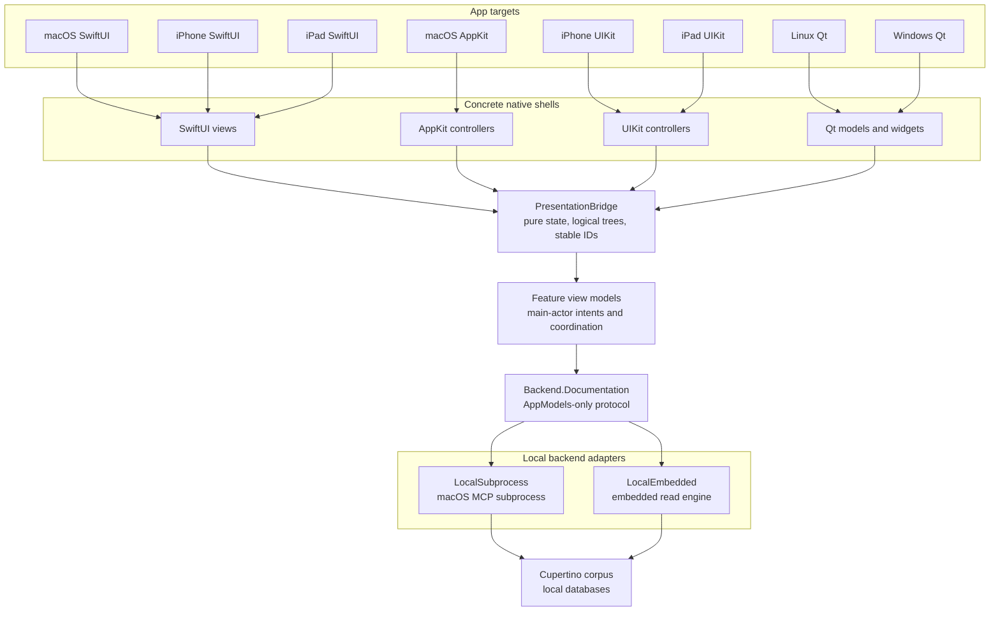

# Cupertino Desktop

A native UI showcase for browsing Apple developer documentation, Swift Evolution, and
sample code offline across macOS, iPhone, iPad, Linux, and Windows. On the Mac it is a thin GUI
client over the [`cupertino`](https://github.com/mihaelamj/cupertino) MCP server: it
spawns `cupertino serve` as a subprocess and talks to it over stdio via
[`SwiftMCPClient`](https://github.com/mihaelamj/SwiftMCPClient). On iPhone, iPad, Linux,
and Windows it uses an in-process embedded read engine over local downloaded or bundled
databases. There is no remote backend path. Either way it does not reimplement search,
indexing, crawling, or storage; Cupertino-owned engine code owns all of that.

The app reaches its backend only through a single `Backend.Documentation` protocol seam, so
nothing in the UI knows whether it is MCP over a subprocess or an in-process engine.

## Eight native UIs over one backend seam

The framework matrix is fixed: **macOS = SwiftUI + AppKit**, **iPhone = SwiftUI +
UIKit**, **iPad = SwiftUI + UIKit**, **Linux = Qt**, and **Windows = Qt**. These are
permanent showcase variants, not candidates for a final single framework choice. The
shared view models and the backend seam are identical across all of them; only the
native view code differs. No variant may be satisfied by hosting one framework inside another. See
[docs/DESIGN.md](docs/DESIGN.md), [docs/UI-DESIGN.md](docs/UI-DESIGN.md), and
[docs/decisions/fixed-native-ui-matrix.md](docs/decisions/fixed-native-ui-matrix.md).

## Status

Early development. What works today, in the current Apple app targets (SwiftUI,
AppKit, UIKit) over the shared view models:

- **Framework browser.** The sidebar lists the real frameworks (with document counts) and
  opens a framework's overview document.
- **Documentation reader.** `read_document` rendered to a full page.
- **Search.** Across the corpus, with a Docs scope (per-source, with framework and
  per-platform-minimum filters) and a unified Everything scope (docs, samples, packages
  bucketed); results open in the reader.

Backends behind the seam:

- **macOS** runs the live `Backend.LocalSubprocess` over `cupertino serve`, which implements
  `listFrameworks`, `readDocument`, `searchDocs`, and `searchEverything`
  (see [docs/PROTOCOL.md](docs/PROTOCOL.md) section 4).
- **iPhone/iPad** (SwiftUI and UIKit) runs `Backend.LocalEmbedded` over a bundled
  real-data corpus captured from the cupertino index, pending the in-process
  `CupertinoDataEngine`.
- **Linux/Windows Qt** is designed as local embedded-engine desktop targets. It is not implemented yet.

Not yet implemented (still failing honestly behind the seam): the **sample-code browser**,
**code intelligence** (symbols, conformances, inheritance), and the real embedded engine.

Milestones are tracked in [docs/DESIGN.md](docs/DESIGN.md).


## Architecture



Layers run one direction only: Foundation -> Infrastructure -> Features -> UI -> Apps. The
`PresentationBridge` target is the shared layer between native shells and feature
coordination: state machines, logical trees, and stable identifiers only. MCP client
and wire types live in the external `SwiftMCPClient` / `SwiftMCPCore` packages; only
the subprocess adapter imports them, and the UI never sees which backend answers.

## Requirements

- macOS 15+ (the desktop apps), iOS 17+ (the iPhone/iPad apps), Linux + Qt and
  Windows + Qt for the planned Qt apps
- Swift 6.2+
- Xcode 16+
- The [`cupertino`](https://github.com/mihaelamj/cupertino) binary (Homebrew) with a
  downloaded corpus in `~/.cupertino`, for the macOS apps. The iOS apps run over a bundled
  corpus and need no binary.

## Building

The library packages live under `Packages/`; the app targets are XcodeGen projects under
`Apps/` (the `.xcodeproj` bundles are generated, not committed).

```sh
# Build and test the packages
cd Packages
swift build
swift test

# Generate the app projects, then open the workspace and pick a scheme
cd ..
brew install xcodegen          # once
./scripts/generate-xcodeproj.sh
open Main.xcworkspace
```

Current app schemes: `CupertinoDesktopSwiftUI` and `CupertinoDesktopAppKit` run on the
Mac; `CupertinoMobileSwiftUI` and `CupertinoMobileUIKit` run on an iOS simulator or
device. The design target is eight native app variants, including split iPhone/iPad
schemes and Linux/Windows Qt.

## Related packages

- [`cupertino`](https://github.com/mihaelamj/cupertino) - the documentation crawler, MCP
  server, and search engine this app is a client of.
- [`SwiftMCPClient`](https://github.com/mihaelamj/SwiftMCPClient) - the transport-injectable
  MCP client.
- [`SwiftMCPCore`](https://github.com/mihaelamj/SwiftMCPCore) - the neutral MCP wire types.

## Contributing

See [CONTRIBUTING.md](CONTRIBUTING.md). The project is early, so major design decisions are
still in flight; start from [docs/DESIGN.md](docs/DESIGN.md).

## License

MIT License, see [LICENSE](LICENSE).
