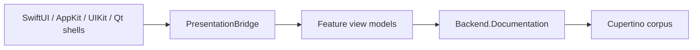

# Decisions

Design decisions that shape the codebase but are not mechanical rules. Each file
records one decision: the context, what was decided, why, and when to revisit. Rules
that a tool can check live in [`../rules/`](../rules/); judgment that it cannot lives
here.

## Current Bridge Shape

- [ui-abstraction-seam.md](ui-abstraction-seam.md) - where the UI abstraction seam
  sits across SwiftUI, UIKit, and AppKit. Abstract task, dialogue, and domain data
  up; hand-write concrete widgets natively per framework. Grounded in the Arch/Slinky
  and CAMELEON literature and the measured failure of full UI generation, with a code
  audit confirming the Presentation-Model / Passive-View split across the shells.
- [fixed-native-ui-matrix.md](fixed-native-ui-matrix.md) - the fixed native UI
  showcase matrix: macOS SwiftUI/AppKit, iPhone SwiftUI/UIKit, iPad SwiftUI/UIKit,
  Linux Qt, and Windows Qt. Also records the no-hosting shortcut rule, local-only backend split,
  main-thread UI rule, and GoF mapping for the framework bridge.
- [large-hierarchy-navigation.md](large-hierarchy-navigation.md) - navigate large
  documentation trees (#49/#50) by Degree-of-Interest (Furnas fisheye), not flat
  lazy-loading. Direction only; greenfield in the code today.
- [ca-list-children-request.md](ca-list-children-request.md) - draft capability
  request for the cupertino agent: a `list_children` primitive for hierarchical
  framework navigation (#49/#50). Not needed for #51.
